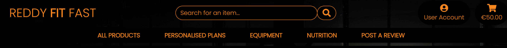
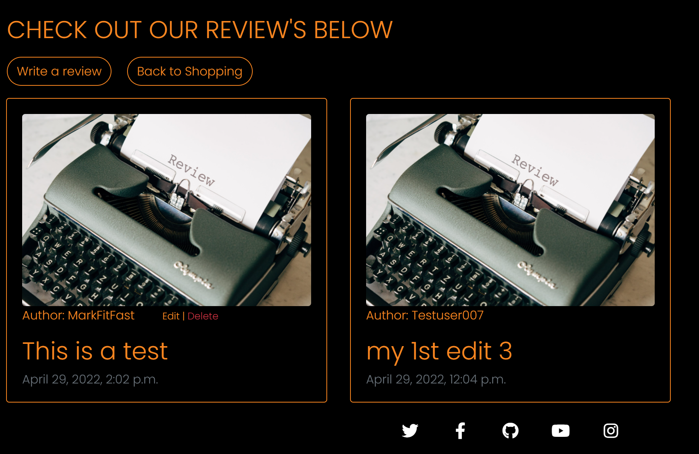

# Welcome To Reddy<strong>Fit</strong>Fast

[Please see my live app here!](https://reddy-fit-fast.herokuapp.com/)

## 1. Purpose of the project

The purpose of this project was to create a fully fledged fitness Ecommerce website where the business model was focused on business to consumer (B2C) activity. Individuals can visit the site and purchase fitness goods and services and have them delivered directly to their home's or their Email inbox. Another main goal of the site was to create a community through the use of social media business pages, the sites review functionality and further online content site's user's could access from the main site footer. I hope to target a wide age range of consumers with the product's and service's available on this page. I aim to target individuals who are not sure how to start their fitness journy, they might want to focus on their diet, starting exercising at home and become a fully fledged gym fanatic. By including varied exercise plans, meal plans, exercise equipment and products I feel that I can tap into the corner of the market.

## 2. User stories

The user stories for this project were written and managed using the agile kanban board function within my GitHub repository [Link here!](https://github.com/users/MarkReddy87/projects/1/views/1)

This is a very user friendly tool, one which I would recommend to anyone undertaking a project of this scope. I was albe to complete nearly all of the user stories I created, the last one involving posting revies to the site caused me some trouble but I am hoping to iron it out in the near future.

The full list of user stories undertaken in this project are detailed below:

1. As a shopper I want to view items in my shopping bag so that I can identify the cost of all items to be received
2. As a shopper I want to be able to sort the available products so that I can identify the best priced products and see a list sorted alphabetically
3. As a shopper I want to easily see the total value of my purchases at any time so that I can avoid spending too much
4. As a shopper I want to view the details of individual products and services so that I can identify prices, images and item descriptions
5. As a shopper I want to be able to view a list of available products and services so that I can select items I wish to purchase
6. As a shopper I want to be able to adjust the quantiy of particular items in my bag so that I can make changes before making a purchase
7. As a site user I want to receive notifications so that I can be aware of any actions that I make within the site
8. As a site user I want to be able to securely checkout so that I can complete my order and pay for my items
9. As a site user I want to receive confirmation of my registration so that I can confirm registration was successfull
10. As a shopper I want to be able to easily enter my payment info so that I can chcekout easily
11. As a site user I want to be able to login to / logout of my account so that I can easily access my profie
12. As a shopper I want to be able to select the quantity of an individual item when purchasing so that I can ensure I dont select the wrong amount
13. As a site user I want to have a personalised user profile so that I can see my order history, save and edit my personal / payment info and view exercise / diet plans that I have purchased
14. As a shopper I want to receive an email summary of my purchase after checkout so that I can confirm the purchase and keep a personal record of it
15. As a shopper I want to be able to view my order confirmation after checkout so that I can ensure no mistakes were made
16. As a site user I want to be able to easily recover my password so that I can regain access to my profile
17. As a site owner I want to be able to add a product or service so that I can update the site with new items when needed
18. As a site owner I want to be able to edit / update a product or service so that I can make changes to the price, description or image
19. As a site owner I want to be able to delete an item from the site so that I can remove products that are no longer for sale
20. As a shopper I want to feel my personal and payment info is safe so that I can confidently provide the necessary info to make a purchase
21. As a site user I want to be able to easily register for an account so that I can save my personal info and fully access the sites capabilities
22. As a site user I want to be able to easily navigate to related social media pages so that I can further explore the business and find other community members
23. As a site user I want to be able to leave a review of a product or service so that I can let other site users know how good or bad my experience with the site was and share my success story
24. As a site owner I want to employ a good SEO strategy so that users can easily find my site when searching online

After reviewing feed back from the my project assessor I drafted a number of new user stories to be implemented as the site was lacking some functionality. I also took advantage the tagging feature which I found to be effective. Below is the list of the new user stories:

25. As a site user I want to be able to leave a review of a product or service so that I can let other site users know how good or bad my experience with the site was and share my success story.
26. As a site I want to be able to edit my posted review so that I can fix any possible mistakes and edit any part of my review.
27. As a site user I want to be able to delete my review so that I can remove the contect from the site if i wish to do so.
28. As a site user I want to receive a confirmation email when I make an order so that I can ensure my order has been processed and paid for.
29. As a site owner I want to create a data scema diagram for the site so that I can visualy showcase the database of the site and how each part interacts with each other.
30. As a site owner I want to give more detail on the purpose of the project as well as its intent so that I can show others the core business / marketing strategies and who is my target audience.
31. As a site owner I want to ensure all the code within my site is pep8 adherent so that I can comply with industry standards and only have clean code within my project.
32. As a site owner I want to complete extensive manual testing and a detailed step by step process of how it was done so that I can show other developers the exacts step takeen / expected when testing the site.
33. As a site user I want to be able to save products to a wishlist so that I can review them further at a later date and decide wheather or not to add them to my basket
34. As a site owner I want to create custom error pages so that I can encourage site user to stay on my site even if something goeas wrong or there is an error
35. As a site owner I want to Dissallow some paths in my robots.txt file so that I can prevent bots from accessing pages that might contain sensitive user information

(<a href="#top">Back to Top</a>)

## 3. Features

The Django framework allows developers to include such a wide variety of features in a short amount of time and this project has only touched the surface of what someone might be capable of doing. Below I will outline some of the main features of Reddy<strong>Fit</strong>Fast accompanied with screenshots from the live site. 

1. The Navigation Bar

The fully responsive navigation bar is consistant across the entire site and allows the user to access any part of the site without the need to use the browser back button or traversing multiple pages to reach a destination. The top of the navigation bar includes the site logo in the top left corner which acts as a home button, beside that in the center there is a search bar where a user can search for any item that may be on the site, to the left or the search bar there is a drop down user profile button allowing access to all account features and in the top right corner there a shopping basket link which also shows a running total of the cost of the basket contents and gives a pop up of the bag contents when an item is added to it. Below all this there are five different link to different parts of the site mostly related to product categories and one for the review page. 

2. The landing page

The home page of the site is a simple but striking one. It includes a strong image of a powerlifter accompanied with inspirational quote designed to envoke a positive reaction. Across the image is a banner letting the customer know that there is no delivery charge for all purchases which may give the user that extra push to make a purchase. Below the quote is a responsive button urging the user to get shopping. Clicking this will bring the user to page containing all the site products and services. 

3. Products page

The products page shows a list of all available products and service contained within bootstrpa cards giving a product image, a product title, the cost of the product and which category the product belongs too. Above the product cards to the left shows a count of the products on page which will update when categories are refined or a search is made. To the right of this is a dropdown menu which allows the customer to sort the products currently on the page by price, by name or by category both ascending or descending. The customer can click the product image which brings them to the product detail page showing further information about the product and giving the ability to add the item to the basket.

4. Shopping Bag Page 

The shopping bag page shows the user a list of all products currently in their basket if there is any and allows them to update the amount of a particular item or delete it alltogether. Below the list of items is the grand total of the order and two buttons which will either bring the user to the checkout page or back to shopping products.

5. The Checkout Page

The checkout page consists of a form on the left side where the user is prompted to fill it out to complete their order. The form includes fields for the customers name, address and card details. Also here the customer can login or create an account allowing them to check a box and save their billing details to their profile so the form is pre filled for their next order. The right side of the page shows the customers final order summary and order grand total.

6. My Profile Page 

The left side of the profile page shows a form prefilled with the users billing info which can be changed and updated whenever the customer needs too. The right side of the page contains a list of the users previous orders and the provided shortened order number can be clicked to bring up the fll details of those orders.

7. Review's page 

The review page shows nicely laid out bootstrap cards, all of which are clickable, containing reviews from other site users describing their experience's. Also displayed are two buttons, one will take you to the form which any registered user can fill out and submit their review to the site. The other brings the site user back to the products page.

8. Newsletter Signup

For the newsletter signup function I chose to use the Mailchimp service which was very easy to use and implement in my sites code. I place the form below the footer in base.html so that it would appear across all pages but would also not take away for the rest of the sites look as you have to scroll down too access it.

9. Wishlist

The wishlist feature add's a nice touch for users to add items to a list so they can be saved for later. This can only be accessed by logged in registered users and each detail page product has a button that will add or remove the item from the users wishlist.

10. Footer 

The footer for the site which is consistant across all pages contains multiple fully responsive social media icon links which will bring the customer to the facebook business page as well as other popular social media sites and also a link to the repository for the site itself.

(<a href="#top">Back to Top</a>)

## 4. Future Features

When using the Django framework the posibility to add more features is endless. Some features I would like to add in the future when the site brand grew would be a gallery wall containing images of users who have transformed themselves with the help of the site and community which might give other site users the motivation to follow in their footsteps. Another feature I think would add value to the site would be a page of hand picked music playlists urging customers to listen while they exercised.

(<a href="#top">Back to Top</a>)

## 5. Typography and color scheme

When choosing a color scheme for the site I wanted to use eye catching and contrasting shades coupled with soft edged responsive elements which were consistant across the site. I felt using the combination of black and orange achieved this well and also the applying the "rounded-pill" bootstrap class across all the sites buttons really makes the elements pop. 
For the main font I chose "Poppins" from the Google Fonts collection, I thought this was a strong bold font which would match the theme of the site and as a back up I went with the classis "sans serif".

(<a href="#top">Back to Top</a>)

## 6. Wireframes

[Link to Project Wireframes](https://balsamiq.cloud/s1wvfc3/php43ry/rCF52).

I found using Balsamiq wireframes very beneficial. This is a great tool to use during the project inception. It allows the user to plan out every page you want to create with great detail and with the variety elements to choose from I feel it can inspire you to come up with new ideas. After creating my wireframes I found myself using them as a constant reference during the coding process.

(<a href="#top">Back to Top</a>)

## 7. Technology

* [HTML](https://en.wikipedia.org/wiki/HTML)
* [CSS](https://en.wikipedia.org/wiki/CSS)
* [JavaScript](https://en.wikipedia.org/wiki/JavaScript)
* [Python](https://en.wikipedia.org/wiki/Python_(programming_language))
* [Django](https://en.wikipedia.org/wiki/Django_(web_framework))
* [PostgreSQL](https://en.wikipedia.org/wiki/PostgreSQL)
* [Bootstrap](https://en.wikipedia.org/wiki/Bootstrap_(front-end_framework))
* [Stripe](https://en.wikipedia.org/wiki/Stripe_(company))
* [Gunicorn](https://en.wikipedia.org/wiki/Gunicorn)
* [Amazon Web Services](https://aws.amazon.com/)
* [Lucid](https://lucid.app/)

(<a href="#top">Back to Top</a>)

## 8. Testing

An abumdance of manual testing was done throughout the development of this project. Before every workspace commit I try would ensure the functionality I was trying to implement was working how I wanted it too by starting the development server and try out that specific function. If there was an issue I would note it in my commit message and come back to it at a later date. This way I was able to keep errors to a minimum. After deploying my project to Heroku I manually retested all the main functionalities to ensure nothing had gone wrong during the process. Naturally there were some issues some of which I will outline in a section below.

### 8.1 code validation

   * HTML - All HTML files were passed through the official [W£C Validator](https://validator.w3.org/#validate_by_input) - I was left with only one fatal error coming from bag.html. The error was cause by a Django Template inheritance for loop and I couldn't find a way around this one without breaking the code. All other no fatal error's seem to be related to Django Template inheritance syntax and seem to be unavoidable.
   * Python - 
   * CSS - No errors were returned after all CSS files were passed through the official [Jigsaw Validator](https://jigsaw.w3.org/css-validator/#validate_by_input)

### 8.2 fixed bugs

A lot of small bugs cropped up during the development process mainly consisting of indentation errors, spelling mistakes and various misplaced brackets. Most of these were easily identified thanks to the DEBUG function within my Github workspace but others needed a little more head scratching.

One strange bug that sticks out for me was with Amazon Web Services (AWS) - It is my first time using this service to store the static files for a project and after I had set up my S3 bucket, added the group / user / policy and entered all the credentials in setting.py my static files still would not load into AWS and my Heroku app kept failing to load the static files during the build process. After combing through the code for hours I had to turn to tutor support where we eventually figured out it was an issue with the Access key ID and Secret access key. After regenerating both of these numerous times and eventually getting one without any /'s in it the Heroku build finally succeeded and the static folder was created in the bucket. This lesson I wouldn't soon forget!

### 8.3 supported screens and browsers

ReddyFitFast was developed entirely on the Google Chrome browser. Using the built developeer tools function really helped identify and target elements I needed to change even if it was only to experiment. Using this tool combined with media queries and the very convienient bootstrap display and colum classes I was albe to make the site look clean on all sizes, from extra large desktops down to mobile.  

(<a href="#top">Back to Top</a>)

## 9. Deployment

The deployment process for ReddyFitFast was my most compelex one to date. I will outline the steps as clearly as I can in the headings below.

### 9.1 via gitpod

This project was built entirely using a [Github](https://github.com/) repository and with [Gitpod](https://gitpod.io/) workspace for version control.

* First I created a repository in my GitHub account and named it appropriately.
* Then I was able to create a GitPod workspace from this repository which included the Code Institute template which included all the necessities to get me started. Here I was able to write and save all my code progress using regular "git add" and "git commit" commands in the workspace terminal.

### 9.2 via heroku

When it was to the project was deployed as a Python based Django applcation on the Heroku cloud platform.
* Firstly a new app was created on the Heroku site and named appropriately.
* Once the required packages were installed with the Gitpod workspace and added to the requirements.txt file I could then apply the correct settings to my Heroku app.
* Under the deploy tab on the Heroku dashboard I connected my Github repository and set up automatic deploy's so that whenever a git push command was issued the app would be re-deployed with the new edits included
* Under the resources tab on the Heroku dashboard I attached the Heroku Postgress add-on to be used as the database from the app and applied the appropriate setting in my workspace.
* Then within the setting tab many different Config Variabless were required to ensure the app deployed correctly and they must directly match the keys and values in your setting.py file in the workspace:
    1. AWS_ACCESS_KEY_ID - recieved from AWS user credentials
    2. AWS_SECRET_ACCESS_KEY - also recieved from AWS user credentials
    3. DATABASE_URL - form the postgress add-on
    4. EMAIL_HOST_PASS - from gmail setting
    5. EMAIL_HOST_USER - an emaill of your own
    6. SECRET_KEY - from a django secret key generator
    7. STRIPE_PUBLIC_KEY - from your stripe API keys
    8. STRIPE_SECRET_KEY - from your stripe API keys
    9. STRIPE_WH_SECRET - from your stripe webhook
    10. USE_AWS - set to true 
* Once all these steps were done the we can then head to the git hub workspace apply all the correct setting and push the code to the main branch and then Heroku will auto bulid the app and with smoe luck it will be successfull.
* Now the app is deployed on Heroku we just need to use AWS to collect the static files to apply all the styling 

### 9.3 via AWS (Amazon Web Services)

On the AWS site once you have created an account you can then search for and add the S3 service, create a bucket, allow the appropriate access, add the correct permisions and attach a group, a user and a policy. Then within the IAM dashboard you retrieve the access keys and insert them into your Heroku config vars and once you apply the correct setting in your Gitpod workspace and issue another "git push" command the Heroku app should now collect the static files from the creatd AWS static folder and apply all the styling to your app. Your app should now be up and running and ready for its final tests. 

(<a href="#top">Back to Top</a>)

## 10. Credits

* [Code Institute](https://codeinstitute.net/) for related course materail, tutor assistance and mentoring sessions.
* [Stack Overflow](https://stackoverflow.com/) for queries on code syntax.
* [w3schools](https://www.w3schools.com/) for further queries on code syntax.
* [GitHub](https://github.com/) for creating project repository.
* [Gitpod](https://gitpod.io/workspaces) for building the project in a workspace.
* [Heroku](https://heroku.com/) for deployinig the completed project.
* [PEP8](http://pep8online.com/) for validating all code within the project.
* [Slack](https://slack.com/) for help with deployment issues.
* [Google Fonts](https://fonts.google.com/) for the fonts used across the site.
* [Adobe Color](https://color.adobe.com/create/color-wheel) for picking colors for the site.
* [Pixabay](https://pixabay.com/) for site inmages.
* [Pexels](https://www.pexels.com/) for site inmages.
* [Font Awsome](https://fontawesome.com/) for all site icons.
* [Amazon Web Services](https://aws.amazon.com/) for hosting static files and images.
* [Balsamiq Wireframes](https://balsamiq.com/wireframes/) for creation of site wireframes.
* [Stripe](https://stripe.com/en-ie) for the sites payment functionality.
* [GraphvizOnline](https://dreampuf.github.io/GraphvizOnline/) for the design of the data schema.
* [XML Sitemaps](https://www.xml-sitemaps.com/) for generating the sitemap.xml file.

(<a href="#top">Back to Top</a>)
