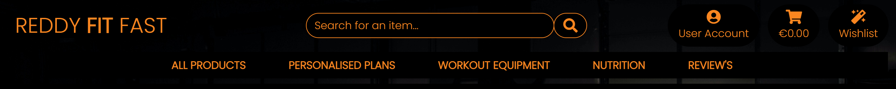
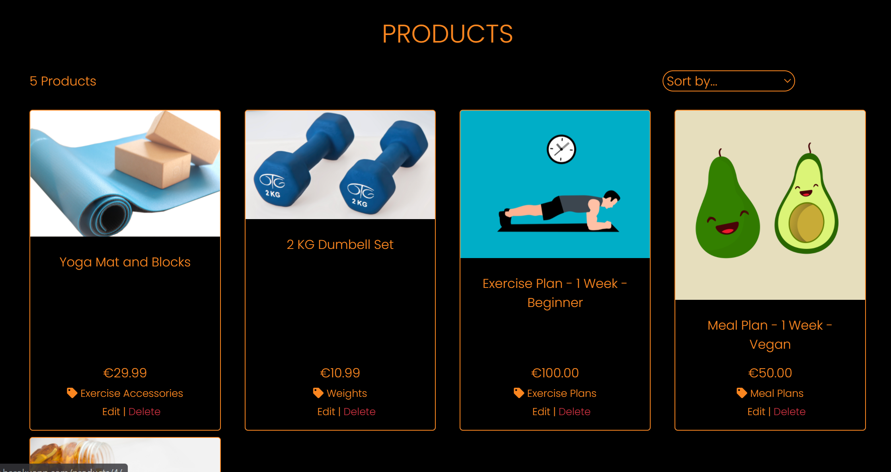
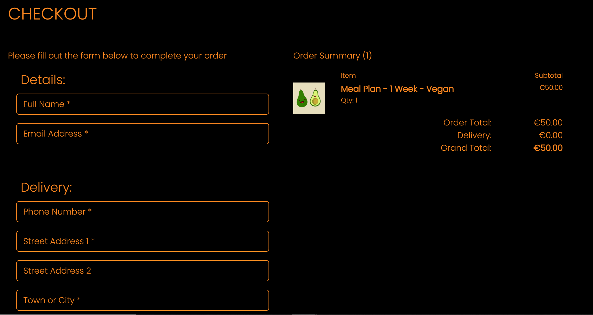
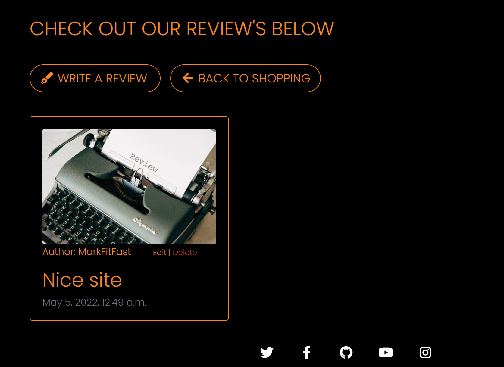
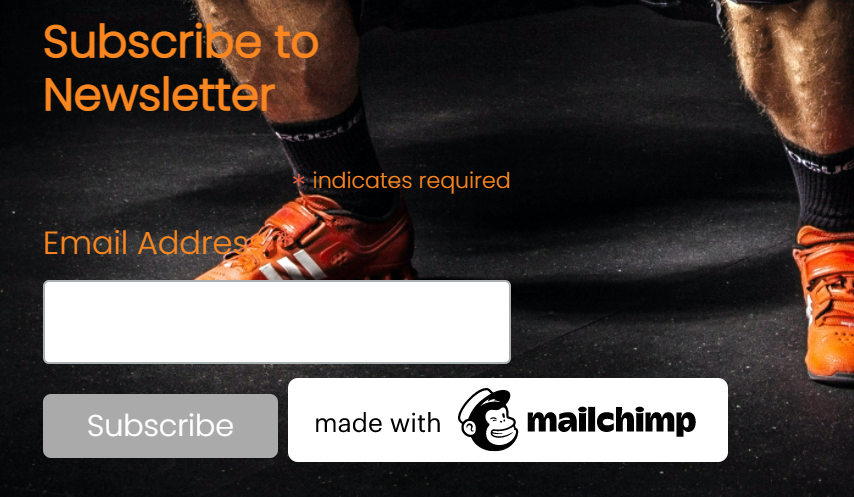
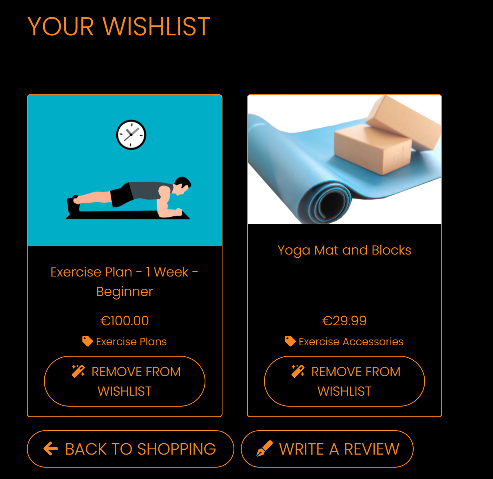
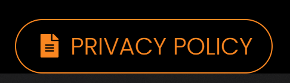
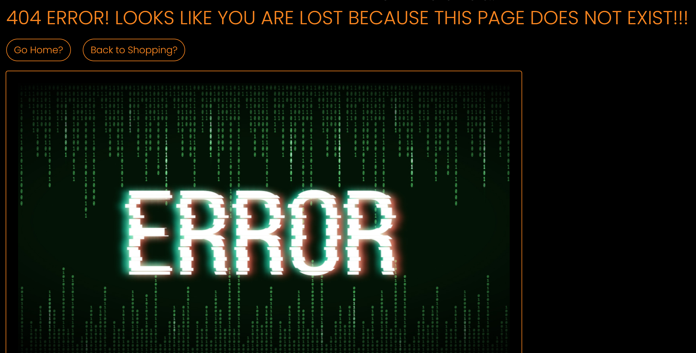

# Welcome To Reddy<strong>Fit</strong>Fast

[Please see my live app here!](https://reddy-fit-fast.herokuapp.com/)

## 1. Purpose of the project

### 1.1 Main purpose / Target Audience

The purpose of this project was to create a fully fledged fitness Ecommerce website where the business model was focused on business to consumer (B2C) activity. Individuals can visit the site and purchase fitness goods and services and have them delivered directly to their home's or their Email inbox. Another main goal of the site was to create a community through the use of social media business pages, the sites review functionality and further online content site's user's could access from the main site footer. I hope to target a wide age range of consumers with the product's and service's available on this page. I aim to target individuals who are not sure how to start their fitness journy, they might want to focus on their diet, starting exercising at home and become a fully fledged gym fanatic. By including varied exercise plans, meal plans, exercise equipment and products I feel that I can tap into the corner of the market.

### 1.2 Marketing Strategies

In this project I utilised a number of different marketing strategies which would allow the site to grow organically. The first and most obvious was to use free social media outlets to promote the site. I created a [Facebook business page](https://www.facebook.com/reddyfitfast/) showing all the relevant information for my site. The page contain's a direct link to the live site as well as similar images the envoke a positive user reaction. The link for this page is also located in the footer of my site along with other helpfull link's that site users could check out. These include a [Twitter link](https://twitter.com/search?q=workout%20tips&src=typed_query) to trending workout tips, a [GitHub link](https://github.com/MarkReddy87/ReddyFitFast) to the repository of the site itself, a [YouTube link](https://www.youtube.com/results?search_query=beginner+yoga) to beginner yoga class videos and an [Instagram link](https://www.instagram.com/explore/search/keyword/?q=meal%20plan) to trending meal plans. All of these links promote positive ways for a site user choose a starting point for their fitness journey and I feel this follows the core value of the site itself. The newly updated review function of the site acts as a sort of content marketing, similar to the footer links. It allows registered users to share their experiences and stories which any site visitor can view, this will allow the community to grow organically and encourage new site users to register and join te fun. 
Another form of marketing I adopted for the site was Email marketing. In the base template, below the footer links of the site, I included a newsletter subscription functionality using MailChimp. Putting it here ensured it was included on every page across the site and was visible to everyone all the time. The MailChimp service is an easy and convenient way to collect user email addresses. The service also allows you to draft email templates and send them to all your subscribers at a time of your choosing, I see this as a very powerful marketing tool. 
Another marketing strategy I used for my project is also the one that is more developer orientated was Search Engine Optimization (SEO). The first thing I did was come up with a list of revevant topics related to my site then with these topics in mind I created keyword dump of both short tail and long tail phrases which I thought would best fit the sites customer needs. I also used google search suggestions to further refine this list and see what related searched were currently trending. I then further narrowed down the list and chose the words and phraese that had the most authority and began to insert then into the sites semantic elements without changing the base content too much as to avoid "keyword stuffing". I  also used strong elements to wrap certain keywords and the rel="noopener" attribute on any anchor elements that linked to external sites as well as relevant alt attributes for all images and the image file name itself. The last place I placed a larges amount of keywords was in the metadata within the head element of base.html here we are allowed to dump as many keywords as you feel necessary as this is what this element is for.
I have also added a new sitemap.xml file, which I have verified with the Google search console and uploaded the .html file to the root directory. I edited the robots.txt file to aid search engines when crawling through the site and have have Dissallowed any url paths that might contain sensative user information.

## 2. User stories

The user stories for this project were written and managed using the agile kanban board function within my GitHub repository [Link here!](https://github.com/users/MarkReddy87/projects/1/views/1)

This is a very user friendly tool, one which I would recommend to anyone undertaking a project of this scope. I was albe to complete nearly all of the user stories I created, the last one involving posting revies to the site caused me some trouble but I am hoping to iron it out in the near future.

The full list of user stories undertaken in this project are detailed below:

1. As a shopper I want to view items in my shopping bag so that I can identify the cost of all items to be received
2. As a shopper I want to be able to sort the available products so that I can identify the best priced products and see a list sorted alphabetically
3. As a shopper I want to easily see the total value of my purchases at any time so that I can avoid spending too much
4. As a shopper I want to view the details of individual products and services so that I can identify prices, images and item descriptions
5. As a shopper I want to be able to view a list of available products and services so that I can select items I wish to purchase
6. As a shopper I want to be able to adjust the quantiy of particular items in my bag so that I can make changes before making a purchase
7. As a site user I want to receive notifications so that I can be aware of any actions that I make within the site
8. As a site user I want to be able to securely checkout so that I can complete my order and pay for my items
9. As a site user I want to receive confirmation of my registration so that I can confirm registration was successfull
10. As a shopper I want to be able to easily enter my payment info so that I can chcekout easily
11. As a site user I want to be able to login to / logout of my account so that I can easily access my profie
12. As a shopper I want to be able to select the quantity of an individual item when purchasing so that I can ensure I dont select the wrong amount
13. As a site user I want to have a personalised user profile so that I can see my order history, save and edit my personal / payment info and view exercise / diet plans that I have purchased
14. As a shopper I want to receive an email summary of my purchase after checkout so that I can confirm the purchase and keep a personal record of it
15. As a shopper I want to be able to view my order confirmation after checkout so that I can ensure no mistakes were made
16. As a site user I want to be able to easily recover my password so that I can regain access to my profile
17. As a site owner I want to be able to add a product or service so that I can update the site with new items when needed
18. As a site owner I want to be able to edit / update a product or service so that I can make changes to the price, description or image
19. As a site owner I want to be able to delete an item from the site so that I can remove products that are no longer for sale
20. As a shopper I want to feel my personal and payment info is safe so that I can confidently provide the necessary info to make a purchase
21. As a site user I want to be able to easily register for an account so that I can save my personal info and fully access the sites capabilities
22. As a site user I want to be able to easily navigate to related social media pages so that I can further explore the business and find other community members
23. As a site user I want to be able to leave a review of a product or service so that I can let other site users know how good or bad my experience with the site was and share my success story
24. As a site owner I want to employ a good SEO strategy so that users can easily find my site when searching online

After reviewing feed back from the my project assessor I drafted a number of new user stories to be implemented as the site was lacking some functionality. I also took advantage the tagging feature which I found to be effective. Below is the list of the new user stories:

25. As a site user I want to be able to leave a review of a product or service so that I can let other site users know how good or bad my experience with the site was and share my success story.
26. As a site I want to be able to edit my posted review so that I can fix any possible mistakes and edit any part of my review.
27. As a site user I want to be able to delete my review so that I can remove the contect from the site if i wish to do so.
28. As a site user I want to receive a confirmation email when I make an order so that I can ensure my order has been processed and paid for.
29. As a site owner I want to create a data scema diagram for the site so that I can visualy showcase the database of the site and how each part interacts with each other.
30. As a site owner I want to give more detail on the purpose of the project as well as its intent so that I can show others the core business / marketing strategies and who is my target audience.
31. As a site owner I want to ensure all the code within my site is pep8 adherent so that I can comply with industry standards and only have clean code within my project.
32. As a site owner I want to complete extensive manual testing and a detailed step by step process of how it was done so that I can show other developers the exacts step takeen / expected when testing the site.
33. As a site user I want to be able to save products to a wishlist so that I can review them further at a later date and decide wheather or not to add them to my basket
34. As a site owner I want to create custom error pages so that I can encourage site user to stay on my site even if something goeas wrong or there is an error
35. As a site owner I want to Dissallow some paths in my robots.txt file so that I can prevent bots from accessing pages that might contain sensitive user information

(<a href="#top">Back to Top</a>)

## 3. Features

The Django framework allows developers to include such a wide variety of features in a short amount of time and this project has only touched the surface of what someone might be capable of doing. Below I will outline some of the main / security features of Reddy<strong>Fit</strong>Fast accompanied with screenshots from the live site. 

### 3.1 Main Features

1. The Navigation Bar

The fully responsive navigation bar is consistant across the entire site and allows the user to access any part of the site without the need to use the browser back button or traversing multiple pages to reach a destination. The top of the navigation bar includes the site logo in the top left corner which acts as a home button, beside that in the center there is a search bar where a user can search for any item that may be on the site, to the left or the search bar there is a drop down user profile button allowing access to all account features and in the top right corner there a shopping basket link which also shows a running total of the cost of the basket contents and gives a pop up of the bag contents when an item is added to it. Below all this there are five different link to different parts of the site mostly related to product categories and one for the review page. 

2. The landing page

The home page of the site is a simple but striking one. It includes a strong image of a powerlifter accompanied with inspirational quote designed to envoke a positive reaction. Across the image is a banner letting the customer know that there is no delivery charge for all purchases which may give the user that extra push to make a purchase. Below the quote is a responsive button urging the user to get shopping. Clicking this will bring the user to page containing all the site products and services. 

3. Products page

The products page shows a list of all available products and service contained within bootstrpa cards giving a product image, a product title, the cost of the product and which category the product belongs too. Above the product cards to the left shows a count of the products on page which will update when categories are refined or a search is made. To the right of this is a dropdown menu which allows the customer to sort the products currently on the page by price, by name or by category both ascending or descending. The customer can click the product image which brings them to the product detail page showing further information about the product and giving the ability to add the item to the basket.

4. Shopping Bag Page 

The shopping bag page shows the user a list of all products currently in their basket if there is any and allows them to update the amount of a particular item or delete it alltogether. Below the list of items is the grand total of the order and two buttons which will either bring the user to the checkout page or back to shopping products.

5. The Checkout Page

The checkout page consists of a form on the left side where the user is prompted to fill it out to complete their order. The form includes fields for the customers name, address and card details. Also here the customer can login or create an account allowing them to check a box and save their billing details to their profile so the form is pre filled for their next order. The right side of the page shows the customers final order summary and order grand total.

6. My Profile Page 

The left side of the profile page shows a form prefilled with the users billing info which can be changed and updated whenever the customer needs too. The right side of the page contains a list of the users previous orders and the provided shortened order number can be clicked to bring up the fll details of those orders.

7. Review's page 

The review page shows nicely laid out bootstrap cards, all of which are clickable, containing reviews from other site users describing their experience's. Also displayed are two buttons, one will take you to the form which any registered user can fill out and submit their review to the site. The other brings the site user back to the products page.

8. Newsletter Signup

For the newsletter signup function I chose to use the Mailchimp service which was very easy to use and implement in my sites code. I place the form below the footer in base.html so that it would appear across all pages but would also not take away for the rest of the sites look as you have to scroll down too access it.

9. Wishlist

The wishlist feature add's a nice touch for users to add items to a list so they can be saved for later. This can only be accessed by logged in registered users and each detail page product has a button that will add or remove the item from the users wishlist.

10. Footer 

The footer for the site which is consistant across all pages contains multiple fully responsive social media icon links which will bring the customer to the facebook business page as well as other popular social media sites and also a link to the repository for the site itself. Below the footer there is also styled button labelled Privacy policy which link to a fully customised and official GDPR/Privacy Policy page for the site user to veiw. This will provide full transparency and give th esite users peace of mind that their data is safe in our hands.

### 3.1 Security Features

One of the main security features present in this project is the use of the Cross-Site Request Forgery(csrf) token which is present on all forms across the site. This token is used to send requests to the server and is tied to the user's session allowing the forms to be validated and protect the data against cross-site request forgery.

Another security feature present in this project is the use of a django super user. This is created in the development enviornment with a Username, Email and Password. We type the command "python3 manage.py createsuperuser" into the terminal within the GitHub workspace and follow the prompts to create the account. Once created this gives the user full access to the admin panel of the site allowing them to create, edit and delete data in the database.

The site is designed in a way so that only registered users can access the full functionality of the site when it comes to writing a review and accessing the wishlist feature. This was achieved mostly by using the @loginrequired decorator on the relevant view functiona as well as simple if/else statements within the html templates and only displaying the crispy form content if the user is authenticated. If not the user is prompted to register for an account to gain full access.

Another security feature implemented was giving only the superuser full CRUD access to the products on the front end. On the relevant pages the site checked if the registered user was also the superuser and if so an extra set of buttons would be displayed allowing editing and deletion of the products within the store.

(<a href="#top">Back to Top</a>)

## 4. Future Features

When using the Django framework the posibility to add more features is endless. Some features I would like to add in the future when the site brand grew would be a gallery wall containing images of users who have transformed themselves with the help of the site and community which might give other site users the motivation to follow in their footsteps. Another feature I think would add value to the site would be a page of hand picked music playlists urging customers to listen while they exercised.

(<a href="#top">Back to Top</a>)

## 5. Typography and color scheme

When choosing a color scheme for the site I wanted to use eye catching and contrasting shades coupled with soft edged responsive elements which were consistant across the site. I felt using the combination of black and orange achieved this well and also the applying the "rounded-pill" bootstrap class across all the sites buttons really makes the elements pop. 
For the main font I chose "Poppins" from the Google Fonts collection, I thought this was a strong bold font which would match the theme of the site and as a back up I went with the classis "sans serif".

(<a href="#top">Back to Top</a>)

## 6. Wireframes

[Link to Project Wireframes](https://balsamiq.cloud/s1wvfc3/php43ry/rCF52).

I found using Balsamiq wireframes very beneficial. This is a great tool to use during the project inception. It allows the user to plan out every page you want to create with great detail and with the variety elements to choose from I feel it can inspire you to come up with new ideas. After creating my wireframes I found myself using them as a constant reference during the coding process. I also downloaded the .bmpr file and a pdf version of the wireframe project, both of which are present in media/wireframes folder.

(<a href="#top">Back to Top</a>)

## 7. Technology

* [HTML](https://en.wikipedia.org/wiki/HTML)
* [CSS](https://en.wikipedia.org/wiki/CSS)
* [JavaScript](https://en.wikipedia.org/wiki/JavaScript)
* [Python](https://en.wikipedia.org/wiki/Python_(programming_language))
* [Django](https://en.wikipedia.org/wiki/Django_(web_framework))
* [PostgreSQL](https://en.wikipedia.org/wiki/PostgreSQL)
* [Bootstrap](https://en.wikipedia.org/wiki/Bootstrap_(front-end_framework))
* [Stripe](https://en.wikipedia.org/wiki/Stripe_(company))
* [Gunicorn](https://en.wikipedia.org/wiki/Gunicorn)
* [Amazon Web Services](https://aws.amazon.com/)

(<a href="#top">Back to Top</a>)

## 8. Testing

An abumdance of manual testing was done throughout the development of this project. Before every workspace commit I try would ensure the functionality I was trying to implement was working how I wanted it too by starting the development server and try out that specific function. If there was an issue I would note it in my commit message and come back to it at a later date. This way I was able to keep errors to a minimum. After deploying my project to Heroku I manually re-tested all the main functionalities to ensure nothing had gone wrong during the process. I will outline all these steps below.

### 8.1 Manual Testing

1. Link Check / Spell Check

After after completing an initial spell check on all pages espically on the product descriptions I then checked that all links in the footer of the page worked correctly by clicking them all to see if they all opened in a new tab and navigated to the correct page which they did. I also checked the privacy policy button which also correctly brought the user to the sites custom policy page. At this point I began to checked all the navigation links on the landing page, including the home button, user account button, shopping basket button, wishlist button, review's button, all the product dropdown links and the get shopping button. They all worked as expected either bringing me to the correct page or showing the correct dropdown menu. From here I could also test if the custom 404 error page was working. To do this I simply typed a url into the address bar which I knew didnt exist and when you press enter the custom 404 error page was correctly displayed confirming its functionality, please see the secrrenshot below.

2. Registration / Authorisation

To test the registration process I first ensured I was logged out by clicking the user account button at the top of the page and seeing that only the "make an account" and "login" link were present. Upon clicking the make an account the user is brought to the sign up form and is prompted to fill in their details to register for an account. I first entered incorrect details for the email field and tried to submit the form but I was prompted to correctly fill out the relevant field, this shows that the form validation was working correctly. After entering valid information and a strong enough password I was brought to a page informing me that an email had been sent to my inbox and I was required to follow the link inside the mail to complete my registration process. I navigated to my email inbox, found the relevant mail and clicked the link which brought me back to the site in a new tab and informed me that the registration was a success and that I was able to log in with the details I had provided. I now navigated to the login link and when I entered valid details and submitted the form a success message popped up in the top right corner letting me know I had successfully signed in and I was presented with the home page again. It was at this point I could confirm that my toast messages were indeed working. Now for every action that was taken on the site I would keep an eye out for the relevant toast message. Now the registration process was complete and the user had full access to the sites functionality.

3. Logged in / Logged out access

I designed this site in a way that only registered user who were logged in had full access to the sites functionality and now that I was a newly registered user I could test this theory. First I logged out of my account then I attempted to access the the wishlist via the button in the top left of the screen but I was immediatly brought to the sign in form letting the user know they need to be logged in and registered to use this feature. I then remained signed out and navigated to the review's tab, I was met with a sample review and two buttons, one to go back and keep shopping and the other was to write a review upon clicking the latter I was shown a message telling the user they need to sign in to leave a review and displayed the relevan buttons to sign in or register for an account. These two tests confirmed that only a registered user had full access to all the site features and the code was working correctly.

4. Superuser

Now I also wanted to confirm if the super user had full access to the site and also if they had full CRUD abilities over the products in the store. To test this I logged out of the current test account then proceeded to login with the superuser details. Once successfull I clicked the get shopping button which brought me to a list of all the products contained on the site and I immediatly could tell the code was working correctly by the presence of the "edit" and "delete" buttons at the bottom of each product bootstrap card. To further verify this I navigated to the product detail page via the clickable product image where the buttons were also present. To test the edit functionality I clicked the edit button on one of the products which brought the superuser to an instance of the product form that was prefilled with all the current data for that particular store item. I made a small change to the product description and then proceeded to click the update button, I was then brought back to the product detail page and could see that the description had been updated with the edit. To test the delete function I navigated to the "manage products" link via the user account dropdown at the top of the page, this link is also only present when the superuser is logged in. Clicking this bring the user to a empty product form where any details can be filled in as well as adding a picture. I filled in some basic details and chose not to add an image to see if my placeholder image code was working. When I clicked the add product button I was taken to the product detail page for the newly created item and could see the placeholder image was present along with all the other details I had entered. Now it was time to test the delete button and when pressed the product was deleted, the page was reloaded and the appropriate toast message was displayed confirming the functionality. Now there was one last thing to do here before moving on, I logged out of the superuser account and back into the test account and navigated back to the products page where I could see that the edit and delete buttons were no longer present confirming the code was working as expected. 

5. Product Sorting / Searching 

Next I wanted to test the ability to sort products from the dropdown menu and via the dropdown links in the navbar. Clicking the all products gives three option, the first is by price which sorts all products by price from lowest to hightest which worked correctly. The next option in the list is by category and sorts all products by catagory and from a-z which worked correctly as well. the last option in this list is all products which sorts all the products by name from a-z which works correctly. Now I could test the the three other drop down nav links, personalised plans, workout equipment and nutrition all of which contain three links, two of which are seperate categories and the third is the first two categories grouped together. All of these link correctly displayed the products by category and by group. This was further confirmed by the presence of the category name/s under the products heading whenever a products page was loaded and these are also clickable buttons which all work as expected. The other way to sort products was via the drop down box on the right of the screen. To test this I navigated to the all products pages so every product on the site was being displayed. then I clicked the drop down box that is labelled sort by... and chose one of the following options: Price(high to low), Price(low to high), Name(a-z), Name(z-a), category(a-z) and category(z-a). I repeated this for all the options and just like before the products were displayed as expected in the correct order. Now it was time to test the product search bar. The search bar was designed to look for any words in the product title, category and product description. I typed the word plan into the search bar and clicked the searc icon (you could also just hit the enter button at this point for the same effect) and as expected the two products containing the word plan in the title were displayed. Now I searched for the word vitamin as I knew that was not in any product titles but it was in a description and as expected the single item which contained the word vitamin in the description was displayed. I then attempted to search a few of the category names and they too displayed the appropriate products from the respective caegories. The last search test was to leave the search bar blank and attempt a search, when I did this the page reloaded, displayed and the site showed an error message letting the user know the "Attempted search was blank, please try again!" This was working as expected. I now know that all features related to products sorting and searching were working correctly. 

6. Shopping bag

Next I wanted to test all the shopping bag functionality. First I navigated to one of the products detail pages by clicking any product card image. Once on this page you will notice there is an add to bag button as well as a quantity incrementer. First I added a single item to the bag by simply clicking the button. This action was verified by the toast success message letting me know what I added to my bag and displaying its details in a small preview window in the corner of the page. I then navigated to a different product detail page and used the plus and minus button to change the quantity up to 2 then back to 1. Before I added the product I typed the number 3 into the quantity box then added the product. As expected the success message and shopping bag preview popped up again letting me know the three products were added successfully and that the quantity function was working as expected. From here I could dismiss the success message and navigate to the shopping bag page via the cart icon link at the top of the page or click the secure checkout button within the success toast message both of which bring the user to their bag where its contents will be neatly displayed in table rows. Here we can see there is another quantity selector and two buttons, all of which need to be tested. First I decremented the amount of the product I had three of down to one and hit the update button and as expected the page reloaded, the quantity changed and the bag total at the bottom updated to reflect the amount selected. Now on the same product of which there was one left I clicked the delete button and as you would think that item was deleted from the basket, the page reloaded, the order total was updated and the success message was displayed again. Everything was working correctly.

7. Checkout form and payment 

The next logical thing to test was the checkout form and payment confirmation. From the shopping bag page we click the secure checkout button, once the page is loaded we see that it is split into two sides. On the left is form which will hold all the customers contact/delivery/payment details and on the other side is the final summary on the users order to be delivered. First the user needs to enter their full name and their email address field is prefilled from the user account. Next we go down through the delivery information fields entering the relevant information as needed, all of these fields are required. The user will only be required to do this once because we can click the checkbox labelled "Save this delivery info to my profile" which will save the users details to their profile and prefill the form during the users next purchase. This is a feature I have previously tested many times and I know works correctly. Now with that done the last piece of the puzzle is to enter the credit card details. Included in the form is a nice minimalistic stripe payment field. This is not set up to take real payments as of now but just test ones but it still works the same as it would in a real scenario. The stripe test card number is 4242 4242 4242 4242 and any date in the future for the expiry date and any sequence of numbers for the zip code will work. Once this "valid" information has been entered the user has one last chance to go back and adjust their purchase before completing their order. The adjust bag button will navigate back to the shopping bag page but if they are happy to go ahead they can click the complete order button. Doing this will trigger a number of things behind the scenes but the user will be presented with a loading overlay screen indicating their payment is being processed and will encourage them not to navigate away from the page until the loading is complete. In the background the Stripe webhook will be triggered and the payment intent will be created. Once the loading screen as finished we are presented with the checkout success page which gives the user a full breakdown of their order including the order number, order details, delivery info and billing amount. Also there is another success message letting the customer know that an email confirmation will be sent to the email address provided by the user. Now everything looks fine but we need to verify a couple of things before we can move on. The first being the confirmation email which is as expected now present in my inbox. The second thing is to verify the payment succeeded. I navigate to my Stripe payment dashboard and clicked on webhooks then the relevant endpoint and as expected there was a 200 response payment_intent.created and succeeded. Everything is working as it should.

8. User Profile

Now it was time to test the user profile. The user can now navigate to the my profile link within the user profile dropdown menu at the top of the screen. Once clicked the user is presented with another page which is split into two parts. On the left is a prefilled form labelled "Default Delivery Information" which contains all the user information which they just entered during the checkout process which can be edited and updated at will. I changed the phone number field and clicked update and sure enough the page reloaded with the form containing the edited information and a success message displayed as usual. On the other side of the page is a list of all the users previous orders layed out in a table. It contains the first five characters of the order number which is a clickable link and will take the user to the complete order summary for that particular order and works as expected the rest of the table columns contain the order date, items ordered and the order total.

9. Reviews CRUD

Now as a registered user I full access to all the sites capabilities and would be able to view, post, edit and delete a review. Upon clicking the review's link at the top of the page the user is brought to a page which displays all the review's left previously by other registered site users layed our nicely again in bootstrap cards. These cards show a standard review image, the review author/username, the review title and the review date. Also if the review author matches the logged in user two extra links are displayed allowing the user to edit or delete their own reviews. Above the bootstrap cards are two more buttons one giving the option to go back to shopping and the other giving the user an option to write their own review to be posted to the site. Both of theses buttons navigation worked as expected. To post a review the user clicks the write a review button and is then presented with a small form containing only two fields: review title and review body which are both required for the form to be valid. Once valid info has been entered the review can then be submitted by clicking the post review button this will bring the user back to the reviews page where their new review is on display for all to see. To edit the review the user must click the edit button on one of their own reviews either from the review page itself of the review detail page. Once click the user is presented with the familiar form but it is now prefilled with an instance of the existing review data. The user can then edit this information however they wish and then hit the update review button which will then navigate to the review detail page for that particular edited review. To delete the review the user can just click the delete button on one of their own reviews either from the review page itself of the review detail page just like before with the edit button. Once done the user is brought back to the review's page where their review is no longer present. When any of these CRUD actions are taken the user get an accompanying taost message in the top right corner, this further cements that the Django messages are working correctly and that the review CRUD functionality is also working as expected.

10. Wishlist

The final piece of functionality to test on the site was the wishlist. A newly registered user could create their wishlist in the database two different ways. The first by simply clicking the wishlist icon in the top right of the screen which would create an empty wishlist and bring the user to it displaying a message telling them they have no items in their list and giving them two button options, one to keep shopping and one to write a review. The second way they can create a wishlist is to navigate to any product detail page all of which will have a "add to wishlist" and "remove from wishlist" button. If they click add to wishlist the new wishlist will be created in the database, that particular product will be added to it and the user will then also be brought to their own wishlist page where they can see the product displayed nicely again in a bootstrap card and saved for later. The user can also remove items from their wishlist from two different locations. The first is again from the product detail page where there will be a "remove from wishlist" button and the second is from the wishlist itself where on every wishlist card there will also be a "remove from wishlist" button. Each time a user add's or remove's an item from their wishlist an appropriate toast success message is displayed in the top right corner confirming the actions. All these functionalities are working correctly and that will conclude a full manual test of all the sites capabilities.

### 8.2 Code Validation

* HTML - No fatal erros were returned when HTML code was passed through the official [W3C Validator](https://validator.w3.org/)

Once the project was fully deployed to Heroku I chose to validate the HTML files by entering the URL's into the site. Upon navigating to the W3C validator site I copied the deployed Heroku URL and pasted it into the address bar and clicked the check button. I repeated this process for all the URL's within the deployed app and addressed all the errors that came up one by one if there was any. Once I thought all the errors were addressed I redeployed the site to Heroku after a git commit and push in the GitPod workspace then I ran all the URL's through the validator one more time to ensure I had fixed everything.

* CSS - No errors were returned when the CSS code was passed through the official [Jigsaw Validator](https://jigsaw.w3.org/css-validator/#validate_by_input)

For the CSS validation I chose to check this by direct input as there was only a small amount of file's to check. Upon navigating to the W3C css validator linked above, I ensured the "by direct input" tab was selected. Then in my workspace I selected and copied the entire contents of the css file and pasted it into the text area on the W3C site then clicked the check button. I then repeated this for all other .css files Thankfully after the first round of check's there were no errors found.

* Python - No errors were returned when the Python code was passed through the [Python Syntax Chacker](https://extendsclass.com/python-tester.html)

To test the python files in this project I used a similar process to the css file. First I navigated to the ExtendClass Python Syntax Checker which is linked above. Then I proceeded to individually copy the entire contents of each .py file I had created and paste the contents into the text area on the ExtendsClass site and click the check python syntax button and for all files I received the "No syntax errors detected" notification for most of the files but there were a few small syntax errors in some of the code taken directly from the Boutique Ado project and I could not remedy them without breaking the functionality of the page so I decided to leave them out. 

* Flake8 Errors

The final piece of code validation I used was in the workspace terminal itself. I typed the command "python3 -m flake8" into the terminal which outputted all the problems within all the files in the workspace and I was able to go through them one by one by holding Ctrl and clicking the link provided which brought me to the exact line of code that was effected. I ignored any warnings from files that were automaticall generated such a migrations so as not to mess with the efficiency of these files and suck to solving any linting issues in files I had created myself. I had to remove some files that were not being used to solve some of the problems and most of the other issues were "line too long" problems or unused import errors. After solving all the relevant issues I was left with mostly line too long errors which I left alone.

### 8.3 Fixed Bugs

A lot of small bugs cropped up during the development process mainly consisting of indentation errors, spelling mistakes and various misplaced brackets. Most of these were easily identified thanks to the DEBUG function within my Github workspace but others needed a little more head scratching.

One strange bug that sticks out for me was with Amazon Web Services (AWS) - It is my first time using this service to store the static files for a project and after I had set up my S3 bucket, added the group / user / policy and entered all the credentials in setting.py my static files still would not load into AWS and my Heroku app kept failing to load the static files during the build process. After combing through the code for hours I had to turn to tutor support where we eventually figured out it was an issue with the Access key ID and Secret access key. After regenerating both of these numerous times and eventually getting one without any /'s in it the Heroku build finally succeeded and the static folder was created in the bucket. This lesson I wouldn't soon forget!

Another bug which cropped up later in development was with connecting my GitHub repository to the Heroku dashboard to allow automatic deploy's. It turned out to be an ongoing security issue and this feature had been disabled. The solution was to remotly deploy the site from my GitPod workspace using the following commands in the terminal:
1. heroku login -i
2. Then enter the relevant login details
3. heroku apps (to show a list of all your heroku apps)
4. heroku git:remote -a your-app-name
5. git add .
6. git commit -m "Deploy to Heroku via CLI"
7. git push origin main
8. git push heroku main (This would then start the app build and the progress could be seen in the terminal and Heroku's activity tab also)

I came across one more bug when doing my final manual testing of the deployed site. When I registered as a new user and tried to access my wishlist before I had added anything to it I recieved and error saying the wishlist did not exist. It was a simple fix where I had to update my wishlist view to mimic the add_to_wishlist view and create/get the wishlist upon accessing the view via the wishlist button. 

### 8.4 Supported Screens and Browsers

ReddyFitFast was developed entirely on the Google Chrome browser. Using the built developeer tools function really helped identify and target elements I needed to change even if it was only to experiment. Using this tool combined with media queries and the very convienient bootstrap display and colum classes I was albe to make the site look clean on all sizes, from extra large desktops down to mobile.  

(<a href="#top">Back to Top</a>)

## 9. Deployment

The deployment process for ReddyFitFast was my most compelex one to date. I will outline the steps as clearly as I can in the headings below.

### 9.1 via gitpod

This project was built entirely using a [Github](https://github.com/) repository and with [Gitpod](https://gitpod.io/) workspace for version control.

* First I created a repository in my GitHub account and named it appropriately.
* Then I was able to create a GitPod workspace from this repository which included the Code Institute template which included all the necessities to get me started. Here I was able to write and save all my code progress using regular "git add" and "git commit" commands in the workspace terminal.

### 9.2 via heroku

When it was to the project was deployed as a Python based Django applcation on the Heroku cloud platform.
* Firstly a new app was created on the Heroku site and named appropriately.
* Once the required packages were installed with the Gitpod workspace and added to the requirements.txt file I could then apply the correct settings to my Heroku app.
* Under the deploy tab on the Heroku dashboard I connected my Github repository and set up automatic deploy's so that whenever a git push command was issued the app would be re-deployed with the new edits included
* Under the resources tab on the Heroku dashboard I attached the Heroku Postgress add-on to be used as the database from the app and applied the appropriate setting in my workspace.
* Then within the setting tab many different Config Variabless were required to ensure the app deployed correctly and they must directly match the keys and values in your setting.py file in the workspace:
    1. AWS_ACCESS_KEY_ID - recieved from AWS user credentials
    2. AWS_SECRET_ACCESS_KEY - also recieved from AWS user credentials
    3. DATABASE_URL - form the postgress add-on
    4. EMAIL_HOST_PASS - from gmail setting
    5. EMAIL_HOST_USER - an emaill of your own
    6. SECRET_KEY - from a django secret key generator
    7. STRIPE_PUBLIC_KEY - from your stripe API keys
    8. STRIPE_SECRET_KEY - from your stripe API keys
    9. STRIPE_WH_SECRET - from your stripe webhook
    10. USE_AWS - set to true 
* Once all these steps were done the we can then head to the git hub workspace apply all the correct setting and push the code to the main branch and then Heroku will auto bulid the app and with smoe luck it will be successfull.
* Now the app is deployed on Heroku we just need to use AWS to collect the static files to apply all the styling 

### 9.3 via AWS (Amazon Web Services)

On the AWS site once you have created an account you can then search for and add the S3 service, create a bucket, allow the appropriate access, add the correct permisions and attach a group, a user and a policy. Then within the IAM dashboard you retrieve the access keys and insert them into your Heroku config vars and once you apply the correct setting in your Gitpod workspace and issue another "git push" command the Heroku app should now collect the static files from the creatd AWS static folder and apply all the styling to your app. Your app should now be up and running and ready for its final tests. 

(<a href="#top">Back to Top</a>)

## 10. Credits

* [Code Institute](https://codeinstitute.net/) for related course materail, tutor assistance and mentoring sessions.
* [Stack Overflow](https://stackoverflow.com/) for queries on code syntax.
* [w3schools](https://www.w3schools.com/) for further queries on code syntax.
* [GitHub](https://github.com/) for creating project repository.
* [Gitpod](https://gitpod.io/workspaces) for building the project in a workspace.
* [Heroku](https://heroku.com/) for deployinig the completed project.
* [PEP8](http://pep8online.com/) for validating all code within the project.
* [Slack](https://slack.com/) for help with deployment issues.
* [Google Fonts](https://fonts.google.com/) for the fonts used across the site.
* [Adobe Color](https://color.adobe.com/create/color-wheel) for picking colors for the site.
* [Pixabay](https://pixabay.com/) for site inmages.
* [Pexels](https://www.pexels.com/) for site inmages.
* [Font Awsome](https://fontawesome.com/) for all site icons.
* [Amazon Web Services](https://aws.amazon.com/) for hosting static files and images.
* [Balsamiq Wireframes](https://balsamiq.com/wireframes/) for creation of site wireframes.
* [Stripe](https://stripe.com/en-ie) for the sites payment functionality.
* [GraphvizOnline](https://dreampuf.github.io/GraphvizOnline/) for the design of the data schema.
* [XML Sitemaps](https://www.xml-sitemaps.com/) for generating the sitemap.xml file.

(<a href="#top">Back to Top</a>)
